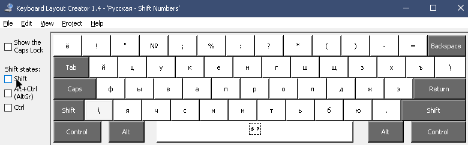

# Windows coding layout

Swapped number rows and special characters.

Installation package available in Releases.

Created in [Keyboard Layout Creator v1.4.0 by Microsoft](https://www.microsoft.com/en-us/download/confirmation.aspx?id=22339).

## English (USA)

## Russian

